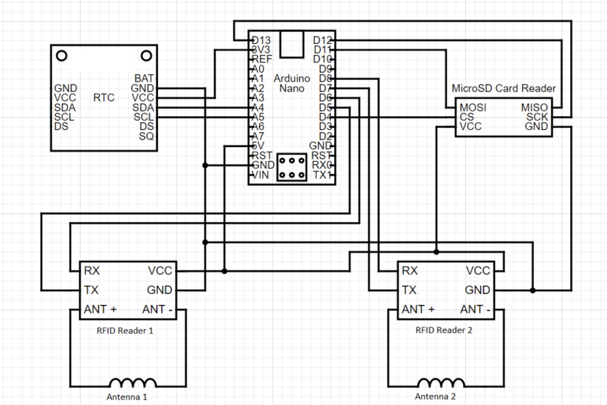

# RePTaR_arduino

We conceptualized, created, and trialed a prototype of a remote passive integrated transponder (PIT) tag reader (RePTaR) for use in obtaining individual identity scans of brown treesnakes (Boiga irregularis) on Guåhan. We investigated if this setup could help remotely scan individuals in a laboratory setting with hopes of eventual use of RePTaR in the field to augment monitoring work being done in targeted study areas. Aadithya Prakash wrote this code to program the Arduino Nano for use in these laboratory tests, details of which can be found at https://github.com/amburgey/RePTaRprototype.git.

# Table of Contents

docs - This folder contains the Arduino Nano datasheet, a helpful guide to programming in the Arduino IDE, and a datasheet for the off-the-shelf RFID reader from Priority 1 Design. The datasheet for the RFID reader also includes resources to create a custom circuit/PCB.

src - The folder contains the code that runs on the Arduino Nano. This code should be flashed onto the device prior to deployment in the field.

# Required Packages and Versions Used

To add libraries go to Sketch -> Include Library -> Manage Libraries. Then Search for the following libraries and click install:

RTClib by Adafruit (v2.1.4)

# Details of Article

Details of this work can be found in the published journal article on this topic:

Amburgey SA, Prakash A, Yackel Adams AA, Siers S, Converse SJ (in prep). Development and evaluation of the remote passive integrated transponder tag reader for customizable monitoring of wildlife. 

# How to Use This Repository

Download the Arduino IDE (v2.1.0) for your respective Operating System (https://www.arduino.cc/en/software). Load the sketch with File -> Open (./src/reptar_code/reptar_code.ino). Before flashing your device, make sure that the Board is set to "Arduino Nano".

Refer below for the wired connections of RePTaR as well as a diagram of all major components of the device. Remember that you will need:
* [2 Priority 1 RFID Readers (RFIDRW-E-TTL)](https://www.priority1design.com.au/shopfront/index.php?main_page=product_info&cPath=1&products_id=10)
* [1 MicroSD Card Reader](https://www.sparkfun.com/products/13743?gad_source=1&gclid=Cj0KCQjw3tCyBhDBARIsAEY0XNn5O9o0Hlj8NBFchsrtCgu6F2ImwUAz-HG_uhyLiJOoTxUlFUqC_hEaAsgHEALw_wcB)
* 1 MicroSD card
* [1 Real Time Clock (we have used the PCF8523)](https://www.adafruit.com/product/3295)
* Copper Wire to create antennas that will be soldered to A+ and A- on the RFID PCB.

Connections for Arduino Nano to other electrical components: 
 * RFID V+              -   5V
 * RFID V-              -   GND
 * MicroSD VCC          -   5V
 * MicroSD GND          -   GND
 * RTC VCC (PCF8523)    -   3.3V
 * RTC GND (PCF8523)    -   GND
 * MicroSD CS           -   pin 4
 * RFID 1 TX            -   pin 5
 * RFID 1 RX            -   pin 6
 * RFID 2 TX            -   pin 7
 * RFID 2 RX            -   pin 8
 * MicroSD DI (MOSI)    -   pin 11
 * MicroSD DO (MISO)    -   pin 12
 * MicroSD SCK (SCK)    -   pin 13
 * RTC SDA (PCF8523)    -   A4
 * RTC SCL (PCF8523)    -   A5

 

